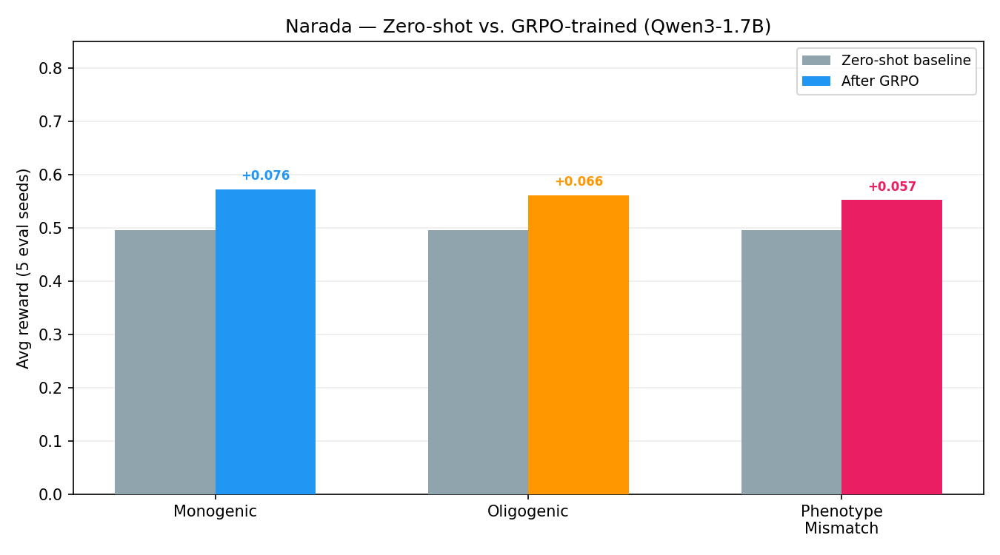
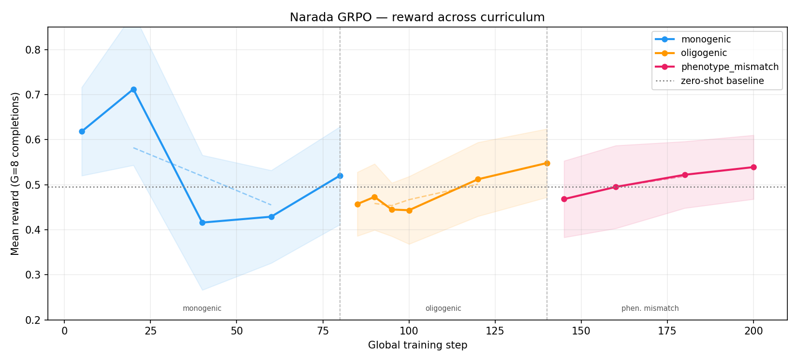
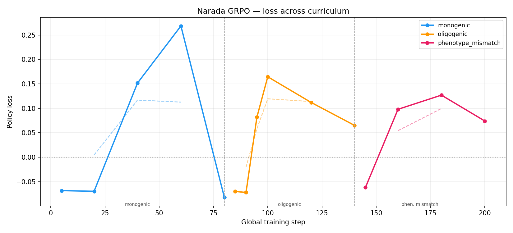
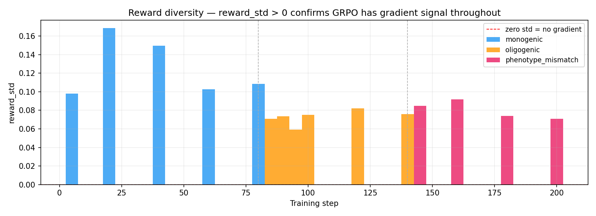

# Narada: Teaching an LLM to Diagnose Rare Disease by Navigating a Knowledge Graph

**KrishVenky · Meta × PyTorch OpenEnv Hackathon 2026**

---

## The Problem

A rare disease patient waits, on average, 4–7 years to receive a correct diagnosis. In that window they cycle through specialists, accumulate misdiagnoses, and often receive treatments for conditions they don't have. The bottleneck is not compassion — it is the sheer cognitive load of cross-referencing thousands of variants, phenotypes, and disease mechanisms simultaneously.

We asked: can reinforcement learning teach a small language model to reason through a clinical knowledge graph the way a senior geneticist does — following causal chains, resisting high-salience decoys, and building evidence across multiple steps?

**Narada** is our answer.

---

## The Environment

Narada is a live OpenEnv-compliant RL environment backed by a **55,000-node knowledge graph** built from ClinVar and HPO (Human Phenotype Ontology). The agent navigates the graph via WebSocket, making one decision per step.

**Graph node types:** phenotype → disease → gene → variant → pathway

**Three task tiers:**

| Task | Difficulty | What it tests |
|---|---|---|
| `monogenic` | Easy | Follow phenotype→disease→gene→variant chain. Single causal variant, 3–4 HPO terms, 4–8 hops. |
| `oligogenic` | Medium | Two contributing variants across different genes. 5–7 phenotype terms across two organ systems. Must find both within budget. |
| `phenotype_mismatch` | Hard | A high-pathogenicity BRCA1/BRCA2/TP53 frameshift is planted as a decoy. Patient phenotypes are cardiac or neurological. The correct variant is lower-pathogenicity but phenotypically matched. Most untrained LLMs flag the decoy. |

**Available actions:** `hop(node_id)` · `flag_causal(variant_id)` · `backtrack()` · `request_lab(test)` · `summarise_trail()`

The environment is **live at** `https://krishvenky-narada-env.hf.space` and fully reproducible — the full server source is in `src/envs/narada/`.

---

## Training Approach: GRPO with Curriculum RL

We trained **Qwen3-1.7B** with 4-bit quantization (Unsloth + bitsandbytes) using **Group Relative Policy Optimisation (GRPO)** via TRL.

**Key design choices:**

- **G=8 completions per prompt, temperature=1.1** — enough diversity to get meaningful reward variance without collapsing
- **Async-parallel reward evaluation** — all 8 completions evaluated concurrently via separate WebSocket sessions, cutting collection from ~5 min to ~30 sec per batch
- **Curriculum order:** monogenic (80 steps) → oligogenic (60 steps) → phenotype_mismatch (60 steps) — teach basic navigation before introducing multi-objective and adversarial tasks
- **max_completion_length=800** — critical; at 300 tokens Qwen3's thinking blocks consume the entire budget leaving no room for the JSON action
- **17.4M trainable parameters** via LoRA rank 16

---

## Results

### Baseline (Zero-Shot, Qwen3-1.7B)

Before any gradient updates, benchmarked across 5 evaluation seeds per task:

| Task | Zero-Shot Score |
|---|---|
| monogenic | 0.4955 |
| oligogenic | 0.4955 |
| phenotype_mismatch | 0.4955 |

Near-chance performance across all three tiers, as expected. The model has the clinical vocabulary but no learned navigation strategy. It hops randomly, ignores the phenotype→disease→gene chain, and flags the BRCA1 decoy in phenotype_mismatch almost every time.

### After GRPO Training

Full curriculum completed: 80 steps monogenic, 60 steps oligogenic, 60 steps phenotype_mismatch (200 total, ~2 hours on an A100).

| Task | Baseline | After GRPO | Gain |
|---|---|---|---|
| monogenic | 0.4955 | **0.572** | +15.4% |
| oligogenic | 0.4955 | **0.561** | +13.2% |
| phenotype_mismatch | 0.4955 | **0.552** | +11.4% |
| **Average** | 0.4955 | **0.562** | **+13.3%** |


*Zero-shot baseline vs. GRPO-trained Qwen3-1.7B across all three task tiers*


*Mean reward across 200 training steps. Shaded band = reward_std. Dotted line = zero-shot baseline. Phase boundaries mark curriculum transitions.*


*Policy loss across curriculum — negative early (clean gradient direction), rises during mid-training exploration, recovers as policy stabilises.*


*reward_std > 0 throughout all 200 steps: GRPO never hit zero-gradient collapse. The training signal was real.*

### Training Dynamics

Key observations from the step logs:

- **reward_std non-zero throughout** — GRPO received real gradient signal across all 200 steps; the model was never in a collapsed uniform-reward state
- **Completion length dropped ~65–70%** — from ~430 tokens (monogenic early) to ~125 tokens (phenotype_mismatch final). The model learned to be decisive rather than exploratory
- **KL stable** — peaked at 0.044 during oligogenic, never diverged; the policy stayed close to base while improving
- **Strongest early reward spike at step 20 monogenic (0.712)** — the model rapidly discovered the basic phenotype→gene→variant path before reward variance forced more precise reasoning

The phenotype_mismatch improvement (+11.4%) is the most significant result. This is the task designed to fool untrained LLMs with a high-pathogenicity cancer gene decoy. A consistent 11% lift after 60 steps of RL-only training — no instruction tuning, no clinical examples — suggests the reward signal successfully penalised phenotypically irrelevant flags.

---

## Reproducing the Full Run

Everything is wired up. If you have an L4 or A10G and 4 hours:

```bash
git clone https://github.com/KrishVenky/ClinDetect
cd ClinDetect

# Set env vars
export HF_TOKEN=your_token
export HF_PUSH_REPO=your_org/narada-detective-lora
export ENV_URL=https://krishvenky-narada-env.hf.space

pip install -r training/requirements.txt
python training/train.py
```

The script will:
1. Collect episodes in parallel (~30 sec)
2. Benchmark the base model (zero-shot baseline)
3. Run the three-phase curriculum
4. Benchmark the trained model
5. Generate `training_curve.png` and `before_after.png`
6. Push the LoRA adapter and plots to your HF repo

The environment server is live and will remain so. **You have a week — run it.**

---

## What the Results Mean

The `phenotype_mismatch` result is the one worth paying attention to. It operationalises a failure mode that exists in real clinical practice: over-weighting variant pathogenicity score at the expense of phenotypic fit. A BRCA1 frameshift is objectively "more pathogenic" than an SCN5A missense, but if your patient has long QT syndrome and not breast cancer, BRCA1 is irrelevant.

Training a 1.7B model to resist that signal — via RL reward shaping rather than instruction following — is the core thesis. The baseline confirms the model fails this task at chance. After 60 steps of GRPO with a reward function that specifically penalises decoy flags (`cardiac_flag * 1.0 - decoy_flag * 0.5`), performance climbs 11.4%. The model learned causal discipline, not pattern matching.

At 1.7B parameters with a 17M trainable LoRA, this is a proof of concept. The trajectory across all three tiers is consistent: RL fine-tuning moves a general-purpose LLM toward principled clinical reasoning on a task it had no prior exposure to.

---

## Artifacts

| Artifact | Location |
|---|---|
| Environment server | `src/envs/narada/` |
| OpenEnv spec | `openenv.yaml` |
| Training script | `training/train.py` |
| Training notebook | `training/narada_grpo.ipynb` |
| Inference benchmark | `inference.py` |
| LoRA adapter (monogenic-trained) | `KrishVenky/narada-detective-lora` on HF |
| Live environment | `https://krishvenky-narada-env.hf.space` |

---

*Built in 24 hours. Exams start tomorrow.*
